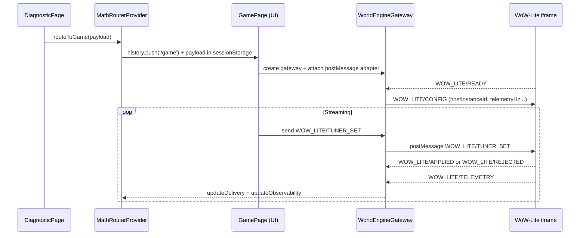

# World Engine IDE — System Audit (Router + Helpers + Protocols)

This document is a repo-wide “map of the system”: how the app boots, how routes connect, which modules own which responsibilities, and how data/control flows through WebSockets and `postMessage`.

> Scope note: this audit prioritizes _runtime wiring_ and _message contracts_ (the things you debug when the system “doesn’t talk”). The repo also contains additional experimental tools under `public/tools/` and server-side helpers; those are cataloged, but not fully re-specified.

---

## 0) Mental model: what “the world engine” is here

At runtime, there are **three main loops**, each with its own transport:

1. **Brain loop (WebSocket)**
   - UI connects to the Python relay and sends commands (`CreateSession`, `ApplyOperator`).
   - Relay returns snapshots (`State.Snapshot`).

2. **World/simulation loop (iframe + postMessage)**
   - The WoW‑Lite simulation runs inside an iframe (`/tools/wow-lite.html`).
   - The host page (`/game`) is the “launcher/editor”: it streams control params and receives telemetry.

3. **UI intent loop (in-memory bus)**
   - UI widgets (HUD panels/minimap/etc.) emit bus events (`UI/*`).
   - Bridges translate those intents into concrete transport messages (mostly `WOW_LITE/*`).

The connective tissue is:

- `BrainConnectionProvider` (Brain WS) → gating + HUD snapshot
- `MathRouterProvider` (payload + observability state) → feeds HUD + diagnostic pages
- `WorldEngineGateway` (single ingress/egress) → binds sources and adapters into a coherent control plane
- `GamePage` (authoritative WoW‑Lite UI) → renders tools and routes traffic through the gateway

And optionally:

- a **popup tool window** (“Nexus Tool”) that talks to the engine via `postMessage` (also routed through the gateway)

### Diagram: high-level connections

```mermaid
flowchart LR
  UI[React UI (Vite)]
  BrainWS[(Brain Relay WS\nbrain/src/.../ws_server.py)]
  HostUI[Host UI\n/game (GamePage)]
  GW[WorldEngineGateway\n(single choke point)]
  Iframe[WoW-Lite runtime\npublic/tools/wow-lite.html]
  ToolWin[Popup Tool Window\npublic/tools/nexus-tool.html]
  Bus[(In-memory bus\nsrc/bus/bus.js)]

  UI -->|WebSocket\nCreateSession/ApplyOperator| BrainWS
  BrainWS -->|State.Snapshot| UI

  UI -->|UI events\n(UI/*)| Bus
  Bus -->|UI intents| GW
  HostUI -->|UI actions| GW

  GW -->|postMessage via adapter\nWOW_LITE/*| Iframe
  Iframe -->|postMessage\nREADY/STATUS/TELEMETRY/APPLIED| GW

  GW -->|postMessage via adapter\nWORLD_EVENT/*| ToolWin
  ToolWin -->|postMessage\nWORLD_EVENT/NEXUS_HELLO| GW
  GW -->|updateDelivery/updateObservability| UI
```

### Diagram: the “/game” runtime loop



## 1) How to Run (Processes + Ports)

### Frontend (Vite + React)

- Command: `npm run dev`
- Serves: `http://localhost:5173` (or next free port)
- Entrypoint: `index.html` → `src/main.jsx` → `src/app.jsx`

### Brain-first dev (UI + Python relay)

- Command: `npm run brain:dev`
- Launches two processes (see `scripts/brain-dev.mjs`):
  - Python relay (`npm run brain:relay`)
  - Vite UI (`npm run dev`)

### Legacy static server (Express)

- Command: `npm start`
- Serves the `public/` directory via Express (see `scripts/start.js`).
- This is primarily for legacy static pages/tools.

### Brain relay (Python WebSocket)

- Module: `brain/src/brain/relay/ws_server.py`
- Default: `ws://localhost:9000`
- Environment variables:
  - `RELAY_HOST` (default `127.0.0.1`)
  - `RELAY_PORT` (default `9000`, falls back to `PORT`)
  - `RELAY_TEST_MODE` (`1/true` enables test mode features)
  - `ARTIFACT_RUN_ID`, `ARTIFACTS_ROOT` (model/tokenizer load)
  - `RELAY_LOG_JSON` (`1/true` prints JSON logs)

### Frontend ↔ Relay wiring

- The UI WebSocket URL is configured by:
  - `import.meta.env.VITE_BRAIN_RELAY_URL` (Vite env)
  - default fallback: `ws://localhost:9000`
- Implementation: `src/brain/BrainConnection.jsx`

---

## 2) Frontend Entrypoints

### Vite entry

- `index.html` mounts `#root` and loads `src/main.jsx`.
- `src/main.jsx` mounts React 18 root and renders `<App/>`.

Files:

- `index.html`
- `src/main.jsx`

### App router + providers

`src/app.jsx` wraps the app in:

- `<Router>` (React Router v5)
- `<BrainConnectionProvider>` (connects to Python relay)
- `<MathRouterProvider>` (routes “math payloads” to `/game` and collects observability)

Files:

- `src/app.jsx`
- `src/brain/BrainConnection.jsx`
- `src/math-router/MathRouter.jsx`

---

## 3) Router Map (React Router v5)

Routing is defined in `src/app.jsx`. Routes are accessible regardless of Brain connection.

### Brain gating behavior

`src/app.jsx` defines `BrainGatedRoute` as a routing wrapper, but it does not block navigation.

- The Brain relay connection is owned by `src/brain/BrainConnection.jsx`.
- Features MAY consult `useBrainConnection()` to enable/disable Brain-backed behavior.

### Route table

- `/` → `src/pages/Nexus.jsx` (not brain-gated)

Routes:

- `/diagnostic` → `src/pages/DiagnosticPage.jsx` (lazy import)
- `/math-app` → `src/pages/DiagnosticPage.jsx` (alias route)
- `/game` → `src/pages/GamePage.jsx` (lazy import)
- `/grid-placement` → `src/pages/GridPlacementPage.jsx` (lazy import)
- `/dashboard` → `src/components/Dashboard/Dashboard.jsx`
- `/studio` → `src/components/Studio/Studio.jsx`
- `/studio/nexus-dual` → `src/components/Studio/NexusDual.jsx`
- `/studio/wow-lite` → `src/components/Studio/WowLite.jsx`
- `/studio/web-dev-guide` → `src/components/Studio/WebDevGuide.jsx`
- `/launcher` → `src/components/Launcher/Launcher.jsx`
- `/neural-core` → `src/components/NeuralCore/NeuralCore.jsx`

---

## 4) Brain Relay (WebSocket API)

### Client behavior

`src/brain/BrainConnection.jsx` owns:

- WS connect/disconnect lifecycle + exponential-ish backoff reconnect.
- On `open`, it sends:

```json
{ "cmd": "CreateSession", "owner": "nexus-ui" }
```

- It accepts messages:
  - `{"type":"SessionCreated","session_id":"..."}` → sets `sessionId`
  - `{"type":"State.Snapshot","state":{...}}` → stores `lastSnapshot`

- Helper API exposed to React:
  - `sendJson(obj)`
  - `applyOperator(operator, params)` → sends:

```json
{ "cmd": "ApplyOperator", "session_id": "...", "operator": "ST", "params": { ... } }
```

### Server behavior

`brain/src/brain/relay/ws_server.py` accepts JSON commands:

- `CreateSession` → returns `SessionCreated`
- `ApplyOperator` → applies operator, emits `State.Snapshot`
- `Infer` (test mode) → returns `infer_result` (tokens + optional model prediction)

Persistence note:

- The relay attempts to initialize a SQLite DB (migrations) for e2e persistence.

---

## 5) MathRouter (Payload routing + Observability aggregation)

The MathRouter is a host-side “control spine” that:

1. Moves a math payload from `DiagnosticPage` → `GamePage`.
2. Maintains **delivery state** (transport readiness, last applied params, errors, latency).
3. Maintains **observability state** (telemetry, stable stats, bus signals) with a strict merge contract.

### Payload routing

- `DiagnosticPage` constructs a payload with `{ schemaVersion: 1, expression, variables, result }` and calls `routeToGame()`.
- `MathRouterProvider.routeToGame()` stores payload in `sessionStorage` and `history.push('/game')`.

Key files:

- `src/pages/DiagnosticPage.jsx`
- `src/math-router/MathRouter.jsx`

### Delivery state

Delivery is updated by the WoW-Lite host integration (see below) via:

- `updateDelivery({ ...partial })`

This is what `DiagnosticPage` displays under “Transport status”.

### Observability aggregation

`MathRouterProvider` subscribes to bus channels:

- `MATH`, `PLACEMENT`, `PHYSICS`, `UI`, `ASSET`

Each event is converted to an Observability patch and merged via:

- `mergeObservability(base, patch)` in `src/control-plane/observabilityContract.js`

Observability is designed to:

- Avoid `undefined` fields
- Reject invalid shapes
- Track “last seen” timestamps/sequences per channel

Key files:

- `src/math-router/MathRouter.jsx`
- `src/control-plane/observabilityContract.js`
- `src/bus/bus.js`

---

## 6) Event Bus (in-memory)

`src/bus/bus.js` is a singleton in-memory event bus.

Contract:

- `bus.emit({ channel, type, payload, atMs })`
- `bus.subscribe(channel, handler) -> unsubscribe()`

Channels are nominally:

- `MATH | PLACEMENT | PHYSICS | RENDER | TELEMETRY | UI | ASSET`

Safety property:

- Handlers are wrapped so a throwing subscriber cannot break the bus.

---

## 7) WoW‑Lite (Launcher ↔ Iframe integration)

### 7.0 Gateway + adapters (current build)

WoW‑Lite runtime traffic is being consolidated behind a single ingress/egress:

- `src/world-engine/gateway/WorldEngineGateway.js`
- `src/world-engine/adapters/WowLitePostMessageAdapter.js`

The gateway can also attach a **tool window** adapter (popup → engine):

- `src/world-engine/adapters/ToolWindowPostMessageAdapter.js`

Host-side protocol helpers (origin allowlist + targetOrigin selection) live in:

- `src/control-plane/wowLiteProtocol.js`

There are two “host bridge” implementations:

1. A small generic bridge hook for the Studio page.
2. A full-featured host implementation in `GamePage`.

### 7.1 Studio bridge (minimal)

`src/components/Studio/WowLite.jsx`:

- In iframe mode (`src="/tools/wow-lite.html"`) it calls:
  - `useWowLiteHostBridge(iframeRef, { enabled })`
- It intentionally disables the host bridge if a parent passes `iframeRef`, because the parent is assumed to own the bridge.

`src/control-plane/useWowLiteHostBridge.js`:

- Creates a `WorldEngineGateway` and attaches `WowLitePostMessageAdapter`
- Subscribes to `WOW_LITE/READY | TELEMETRY | STATUS | APPLIED` via the gateway
- Updates MathRouter delivery/observability
- Relays `UI/SET_TELEMETRY_ENABLED` into `WOW_LITE/DEBUG_SET` through the gateway

### 7.2 Game bridge (authoritative)

`src/pages/GamePage.jsx` owns the authoritative integration when you route into `/game`.

Core responsibilities:

- Establishes a per-instance host identity: `hostInstanceId`
- Routes WoW‑Lite postMessage send/receive through `WorldEngineGateway`
- Implements a **revisioned** tuner update stream with ACK/REJECT + timeout/retry
- Consumes iframe telemetry and computes stable stats (EMA + jitter)
- Echoes stable stats back into the iframe (`WOW_LITE/STABLE_STATS`)
- Implements launcher-only editor tools:
  - param sliders → `WOW_LITE/TUNER_SET`
  - texture import → `WOW_LITE/ASSET_TEXTURE_SET`
  - click-to-place → `WOW_LITE/EDITOR_PLACE_REQUEST`

It also exposes a demo popup tool window button (**Nexus Tool**) which opens:

- `public/tools/nexus-tool.html`

That tool window sends messages back to the engine via `window.opener.postMessage(...)`, and the engine routes them through `WorldEngineGateway`.

Environment variables used by the `/game` implementation:

- `VITE_NEXUS_TOOL_URL` (default: `${window.location.origin}/tools/nexus-tool.html`)
- `VITE_NEXUS_TOOL_ORIGIN` (default: `window.location.origin`)

#### Revision + ACK semantics

- Host sends `WOW_LITE/TUNER_SET` with `revision` that monotonically increments.
- Game applies if `revision > lastRevisionApplied`.
- Game emits:
  - `WOW_LITE/APPLIED` once per revision
  - or `WOW_LITE/REJECTED` with reason and sometimes `currentParams`.
- Host considers a send “degraded” if no ACK within ~1500ms after a retry.

#### Telemetry and health

- Game emits `WOW_LITE/TELEMETRY` samples.
- Host normalizes via `toTelemetrySample()` (observability contract).
- Host computes `health`:
  - `LOW_FPS` if stable FPS < 20
  - `HIGH_JITTER` if jitter > 12ms
  - `STALE` if telemetry/stable is stale

#### Grid overlay

The `/game` page includes a visual-only grid overlay:

- Implemented as an absolutely-positioned DIV with `pointerEvents: none`.
- Purpose: aid spatial alignment without stealing input from the iframe.

---

## 8) WoW‑Lite Runtime (public/tools/wow-lite.html)

The WoW‑Lite runtime is a static HTML tool served from `public/tools/wow-lite.html`.

Key properties:

- Uses `postMessage` to communicate with its host page
- Guards by:
  - `event.source === globalThis.parent`
  - `event.origin === transport.hostOrigin` when available (derived from `document.referrer`)
- Maintains `transport.hostInstanceId` to prevent cross-talk
- Includes `schemaVersion: 1` on outbound messages (READY/STATUS/TELEMETRY/APPLIED/REJECTED + texture ACKs)

### 8.1 PostMessage protocol (WOW_LITE/\*)

All messages use `type` and `schemaVersion: 1`.

#### Host → Game

- `WOW_LITE/CONFIG`
  - `{ schemaVersion: 1, hostInstanceId, desiredRateHz, telemetryEnabled, telemetryHz }`

- `WOW_LITE/DEBUG_SET`
  - `{ schemaVersion: 1, hostInstanceId, telemetryEnabled, telemetryHz }`

- `WOW_LITE/STABLE_STATS`
  - `{ schemaVersion: 1, hostInstanceId, stableSeq, basedOnTelemetryAtMs, data, now }`

- `WOW_LITE/TUNER_SET`
  - `{ schemaVersion: 1, messageId, revision, sentAtMs, hostInstanceId, params }`

- `WOW_LITE/ASSET_TEXTURE_SET`
  - `{ schemaVersion: 1, hostInstanceId, name, dataUrl }`

- `WOW_LITE/EDITOR_PLACE_REQUEST`
  - `{ schemaVersion: 1, hostInstanceId, instanceId, screen:{x,y,w,h}, prefabId }`

#### Game → Host

- `WOW_LITE/READY`
  - Advertises supported params, ranges, rate limits, supported telemetry fields.

- `WOW_LITE/STATUS`
  - Heartbeat with `lastRevisionApplied` and `currentParams`.

- `WOW_LITE/TELEMETRY`
  - `{ schemaVersion: 1, hostInstanceId, now, data:{ fps, dtMs, frameTimeMs, ... } }`

- `WOW_LITE/APPLIED`
  - `{ hostInstanceId, revision, appliedParams, appliedAtMs }`

- `WOW_LITE/REJECTED`
  - `{ hostInstanceId, revision, reason, lastRevisionApplied?, currentParams? }`

- `WOW_LITE/ASSET_TEXTURE_APPLIED`
  - `{ hostInstanceId, name, appliedAtMs }`

- `WOW_LITE/ASSET_TEXTURE_REJECTED`
  - `{ hostInstanceId, name, reason }`

- `WOW_LITE/ENTITY_UPSERT`
  - emitted after `EDITOR_PLACE_REQUEST` resolves

- `WOW_LITE/ENTITY_REMOVE`
  - (host-side handlers exist; emission depends on runtime logic)

### 8.2 Tuner application model

The runtime maintains both current and target values to avoid jitter:

- `MOVE_SPEED_TARGET`, `GRAVITY_TARGET`, `JUMP_SPEED_TARGET`, `MANA_REGEN_RATE_TARGET`

And it clamps updates to declared ranges.

### 8.3 Texture application

- Accepts `dataUrl` (typically from host `FileReader.readAsDataURL`).
- Applies to `groundMat.map` via `THREE.TextureLoader`.
- Emits applied/rejected ack messages.

### 8.4 Networking note (separate WS)

Inside `wow-lite.html` there is also an independent WebSocket client (experimental):

- `new WebSocket('ws://localhost:8080')`

This is disabled by default; opt-in by adding `?enableWs=1` to the iframe URL.

This is **not** the Brain relay. It appears to be a separate multiplayer/prediction experiment.

---

## 9) HUD Overlay (Host-side)

`HudRoot` is a host overlay that renders health/FPS and UI panels.

- `src/ui/HudRoot.jsx` reads:
  - `useObservability()` → pulls `{ observability, delivery }` from MathRouter
- It emits UI intents via:
  - `useUiActions()` → emits bus events (MINIMAP_PING, SET_TELEMETRY_ENABLED, etc.)

Key files:

- `src/ui/HudRoot.jsx`
- `src/state/useObservability.js`
- `src/state/useUiActions.js`

---

## 10) Orchestrator (TypeScript, optional)

The orchestrator is a separate event routing pipeline under `src/orchestrator/`.

- Entry: `src/orchestrator/index.ts` (ts-node runnable)
- Bridges:
  - `ConsoleBridge`
  - `WSBridge` (sends envelopes to `BRAIN_RELAY_URL` default `ws://localhost:9000`)
  - `SQLiteMemoryBridge` (writes envelopes to `./orch_outbox.sqlite`)

It’s currently a demo / plumbing layer; it does not appear to be wired into the React UI runtime by default.

---

## 11) Additional Tools / Protocols (catalog)

The repo contains several standalone HTML tools under `public/tools/`.

Examples:

- `public/tools/wow-lite.html` — WoW‑Lite iframe runtime.
- `public/tools/nexus-tool.html` — minimal popup tool window (engine ↔ tool postMessage demo).
- `public/tools/nexus-dual.html` — “Dual-Sandbox” demo using `__nexus` postMessage envelopes.
- `public/tools/render-browser.html` — render inspector tool (posts `{type:'highlight', ...}` to an iframe).
- `public/tools/lmn-ide.html` — lightweight multi-language IDE.

There is also a `NeuralCore` React component that listens for `__nexus` messages and calls a pluggable `brainOp` function:

- `src/components/NeuralCore/NeuralCore.js`

---

## 12) Directory Map (what lives where)

Top-level highlights:

- `src/` — Vite/React app (router, pages, UI, control plane)
- `public/` — static tools and legacy HTML
- `brain/` — Python Brain + WebSocket relay + tests
- `server/` — Node scripts (consultant proxy / ollama integration)
- `scripts/` — node launchers and legacy build/start scripts
- `engine/` — separate package subtree (appears to be a standalone engine project)

Inside `src/` (selected):

- `src/pages/` — route pages (`Nexus`, `DiagnosticPage`, `GamePage`, `GridPlacementPage`)
- `src/brain/` — Brain WS connection provider
- `src/control-plane/` — bridges and observability contract
- `src/bus/` — in-memory bus
- `src/math-router/` — routes math payload into the game + aggregates observability
- `src/ui/` — HUD overlay and panels
- `src/orchestrator/` — TypeScript orchestrator demo
- `src/world-engine/` — gateway + adapters (single ingress/egress control plane)

---

## 13) “Single source of truth” rules (current architecture)

- The **launcher/host** (`/game` via `GamePage`) is the authoritative editor UI.
- The **iframe runtime** (`public/tools/wow-lite.html`) should not render editor toolbars; it should only:
  - apply streamed params/assets
  - emit telemetry/state
  - accept host-driven editor requests

This avoids input conflicts and duplicated controls.

---

## 14) Where to look when something breaks

- Relay disconnect / gated routes redirecting:
  - `src/brain/BrainConnection.jsx`
  - `src/app.jsx` (`BrainGatedRoute`)

- “math routed but game not booting”:
  - `src/math-router/MathRouter.jsx` (payload/sessionStorage)
  - `src/pages/DiagnosticPage.jsx` (routeToGame)
  - `src/pages/GamePage.jsx` (payload validation)

- Tuner changes not applying:
  - Host send loop in `src/pages/GamePage.jsx` (`WOW_LITE/TUNER_SET`)
  - Iframe handler in `public/tools/wow-lite.html` (`handleTunerSetMessage`)

- Telemetry health/fps missing:
  - `public/tools/wow-lite.html` (`WOW_LITE/TELEMETRY`)
  - `src/control-plane/observabilityContract.js` (`toTelemetrySample`)
  - `src/pages/GamePage.jsx` telemetry handler

- Telemetry enable toggle not working:
  - `src/state/useUiActions.js` emits `UI/SET_TELEMETRY_ENABLED`
  - `src/pages/GamePage.jsx` (bus subscription → `WOW_LITE/DEBUG_SET`)
  - `src/control-plane/useWowLiteHostBridge.js` (Studio-only bridge)
